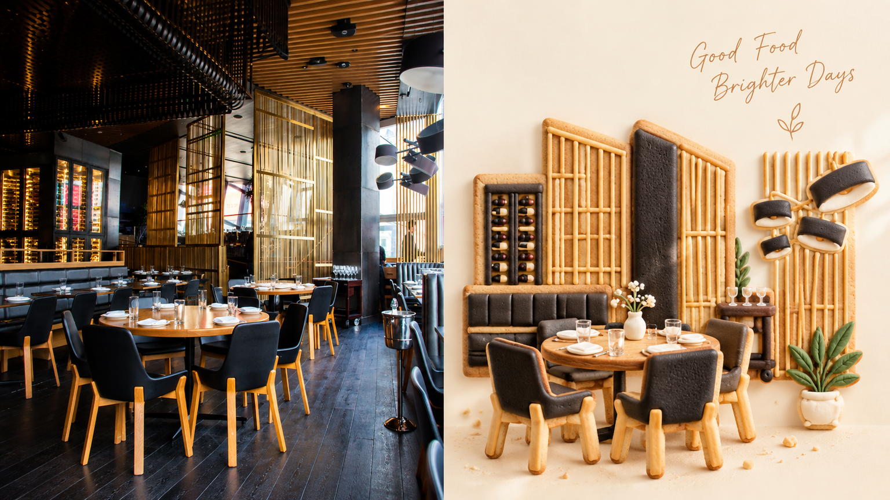
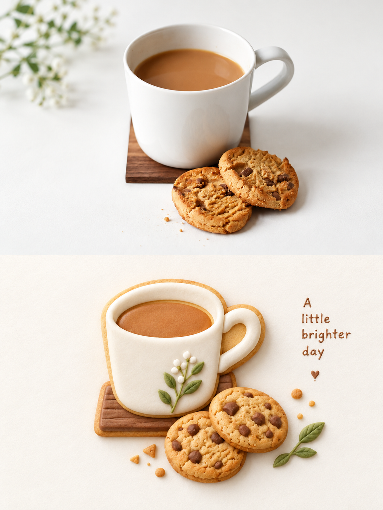
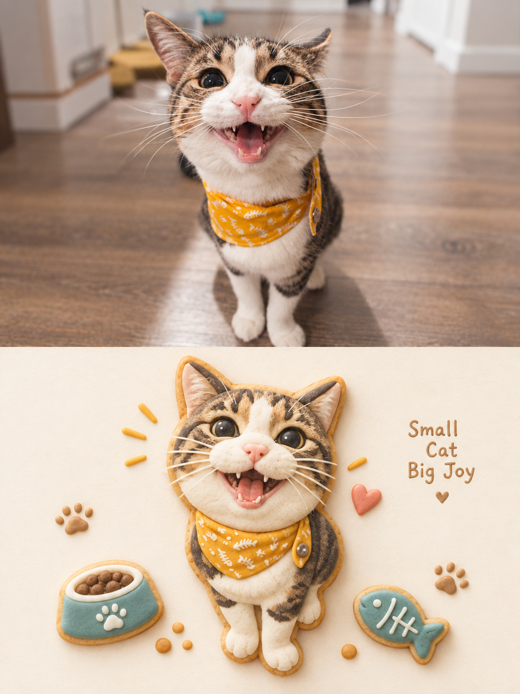

<div align="center">

# XXD Panel 226｜糖霜曲奇浅浮雕

أعد بناء روح الصورة كقطعة كوكيز مغطاة بالثلج المطفي: مستديرة، مصغّرة، بفراغ واسع.

<a href="README.md">简体中文</a> · <a href="README.en.md">English</a> · <a href="README.ja.md">日本語</a> · <a href="README.ko.md">한국어</a> · <a href="README.ar.md">العربية</a>

</div>

> مدخل النص الأصلي (باللغات الخمس): [简中](references/original-prompt/zh-CN.md) · [English](references/original-prompt/en.md) · [日本語](references/original-prompt/ja.md) · [한국어](references/original-prompt/ko.md) · [العربية](references/original-prompt/ar.md)。

## نماذج 16:9 يسار–يمين

أربع مصادر مستقلة على لوحة 16:9 مكتملة: الواقع يساراً وتصميم هذا اللوح يميناً، مناصفة دقيقة 50:50.

<table>
  <tr>
    <td width="50%"></td>
    <td width="50%"></td>
  </tr>
  <tr>
    <td width="50%"></td>
    <td width="50%"></td>
  </tr>
</table>

## نماذج 3:4 أعلى–أسفل

أربع مصادر أخرى مستقلة، مختلفة عن مجموعة 16:9، بلوحة 3:4 مكتملة: الواقع أعلى والتصميم أسفل، مناصفة دقيقة 50:50.

<table>
  <tr>
    <td width="50%"></td>
    <td width="50%"></td>
  </tr>
  <tr>
    <td width="50%"></td>
    <td width="50%"></td>
  </tr>
</table>

## الحالات المناسبة والمشكلات التي يحلها

لتحويل صورة يومية إلى مصغّر دافئ قابل للجمع: أرشيف شخصي، نشر مستقل، دراسات معرض وعلامات أسلوب حياة. النصف العلوي يحتفظ بالصورة الأصلية؛ والنصف السفلي ليس مرشح كوكيز على الصورة. يقرأ المعنى والعلاقات ثم يعيد بناء الموضوع ومحيطه الضروري كقطعة بارزة منخفضة من الثلج والمارزيبان والطين الناعم.

النتيجة بسيطة وكاملة وشعرية ودافئة وقابلة للجمع: ختم صغير على ورق واسع، بألوان ثلج ناعمة مضيئة. تجنّب النسخ الحرفي، وملء الخلفية، واللمعان البلاستيكي، والكارتون الرخيص، وأيقونات القوالب.

## نصائح الاستخدام

- **ابدأ بصورة واحدة واضحة:** اختر صورة يسهل تمييز موضوعها وحركتها وعلاقاتها، ثم حدّد طريقة الإخراج ونسبته.
- **اجمع المعاملات في جملة واحدة:** قل «علوي-سفلي / يسار-يمين / تصميم فقط + 16:9 / 3:4 / خلفية هاتف»، ويمكنك إضافة مقاس الكمبيوتر أو الجهاز اللوحي أو الساعة الذكية.
- **حدّد ما يجب الحفاظ عليه:** اذكر الأشخاص والأشياء والحركات والعلاقات والنص المطلوب إبقاؤه، واترك مساحة كافية للأسلوب كي يصمم التخطيط.
- **اختر طريقة النص:** دع النموذج يولّد النص من الصورة، أو ثبّت الصياغة حرفياً عبر `--text exact --copy`، أو ألغِ النص تماماً عبر `--text none`.
- **وضّح منطقتي الواقع والتصميم:** في العلوي-السفلي أو اليسار-يمين، اذكر أي منطقة تحتفظ بالصورة وأيها يعاد تصميمها؛ وفي التصميم فقط والخلفيات اذكر أن اللوحة كلها يعاد تصميمها.
- **اختبر صورة واحدة قبل المعالجة الدفعية:** أكّد النمط والنسبة والنص واللغة على صورة واحدة، ثم استخدم الإعدادات نفسها لمجلد كامل؛ غيّر متغيراً واحداً في كل جولة.

## البدء

التثبيت من GitHub:

```bash
npx skills add https://github.com/nevertoday/xxd-panel-226 --skill xxd-panel-226
```

بعد التثبيت أعد تشغيل جلسة Agent ثم استدعِ `$xxd-panel-226`. ويمكن إضافة `--global --agent codex --yes` للتثبيت على مستوى المستخدم.

```text
/xxd-panel-226 photo.jpg --mode top-bottom --size 3:4 --text prompt --locale ar-SA
/xxd-panel-226 photo.jpg --mode left-right --size 16:9 --text prompt --locale en-US
/xxd-panel-226 photo.jpg --mode design-only --size 9:16 --text none --prefs off
```

راجع [SKILL.md](SKILL.md) لعقد التشغيل الكامل، ومهايئ التشغيل [بالإنجليزية](references/xxd-panel-226-prompt.en.md) أو [بالصينية](references/xxd-panel-226-prompt.zh-CN.md).

## الموجّه الأصلي

يُحفظ [النص الصيني الكامل](references/original-prompt/zh-CN.md) حرفياً بوصفه المرجع الوحيد للإبداع والجماليات أثناء التشغيل. تتضمن هذه الدفعة إرشادات استخدام بخمس لغات، دون أربع ترجمات إضافية للنص الطويل. ملخصات الأسلوب للاكتشاف فقط ولا تحل محل الأصل.

## فحص الملاءمة السريع

احفظ هوية الأصل مع إعادة إخراج التكوين، واجمع ملمس الخامة والفراغ المقصود. اختر نصاً حرفياً أو مولداً أو بلا نص، مع معالجة صورة واحدة أو مجلد متداخل والأنماط الأربعة أدناه.

## أنماط الإخراج الأربعة

- `top-bottom`: منطقتان أفقيتان كاملتا العرض فقط؛ الواقع في الأعلى والتصميم في الأسفل، 50% لكل منهما.
- `left-right`: منطقتان عموديتان كاملتا الارتفاع فقط؛ الواقع يساراً والتصميم يميناً، 50% لكل منهما، ولا يتحول إلى تخطيط علوي/سفلي.
- `design-only`: تعرض اللوحة الكاملة ترجمة Panel 226 التصميمية فقط، وتبقى الصورة مرجعاً غير ظاهر.
- `wallpaper-pack`: ينشئ عملاً كاملاً للهاتف وiPad وسطح المكتب والساعة، إما كعائلة `linked` أو أربعة أعمال `independent`.

يمكن جمع الأنماط والأحجام. تشمل النسب `1:1` و`3:4` و`4:3` و`4:5` و`5:4` و`2:3` و`3:2` و`9:16` و`16:9` و`21:9` و`5:7` و`7:5` والبكسلات الدقيقة. يمكن أن يكون النص مولداً أو حرفياً من المستخدم أو غائباً. عند إدخال مجلد، تُعالج كل صورة بمعزل عن الأخرى مع إعدادات تسليم مشتركة، وتوضع ملفات PNG النهائية مباشرة في مجلد مهمة جديد واحد.

<!-- xxd-readme-ads:start -->
## عن XXD

XXD هو اختصار اسم علامة Xiaoxiaodong. أنشأ هذا المشروع ويديره [@xiaoxiaodong01](https://x.com/xiaoxiaodong01).

## عضوية Xiaoxiaodong متعددة المنصات · 699 يواناً صينياً سنوياً

> **إفصاح إعلاني:** رمز QR وروابط العضوية والخدمات المدفوعة أدناه معلومات ترويجية من XXD. المسح أو الشراء اختياري تماماً ولا يؤثر في استخدام المشروع المفتوح المصدر.

تفتح عضوية سنوية واحدة ثلاث مزايا معاً: **Knowledge Planet + مكتبة توجيهات أعضاء XXD + عضوية جميع Skills من مستوى General**. المزايا الثلاث ضمن عضوية واحدة ولا يلزم شراء منفصل.

<!-- xxd-panel-command-system:start -->

### كيف تتعاون الـ Skills

| المستوى | ما يتضمنه | المهمة |
|---|---|---|
| **General** | [`xxd-panel-all`](https://github.com/xiaoxiaodong-ai/xxd-panel-all) | يكتشف Skills المرقمة المتاحة، ويرشحها حسب الصورة أو الموضوع أو الاستخدام، وينظم المهام متعددة الأساليب والدفع بالجملة. |
| **Soldier** | `xxd-panel-NNN` | تنفذ كل مهارة مرقمة موجّهها الأصلي وجماليتها الخاصة، وتنجز المهمة المحددة التي يوزعها General. |

<!-- xxd-panel-command-system:end -->

### ماذا تحصل عليه

1. **استشارات فردية عبر WeChat لتعلّم الذكاء الاصطناعي والمشاريع**
   أضف Xiaoxiaodong على WeChat عبر رمز QR أدناه للتواصل الفردي حول تعلّم الذكاء الاصطناعي والأدوات والمشاريع العملية والحصول على إرشادات وإجابات مفيدة. يمكن تنظيم الأسئلة المميزة ضمن محتوى الأعضاء.
2. **مكتبة توجيهات للأعضاء تتوسع باستمرار**
   تضم [مكتبة توجيهات أعضاء XXD](https://vip.xiaoxiaodong.ai/) حالياً نحو 32 ألف توجيه، وستواصل التنظيم والتوسع بهدف تجاوز 100 ألف.
3. **جميع Skills من مستوى General ودعم الاستخدام**
   تغطي عضوية واحدة جميع Skills من مستوى General، مع إرشادات ودعم للأسئلة عند الحاجة.
4. **أولوية للطلبات شديدة الاحتياج**
   تُراجع التوجيهات والـ Skills ذات الطلب المرتفع والاحتياج الفعلي وتُطوّر أولاً حيثما كان ذلك مناسباً.

### كيفية الاشتراك

- [فعّل العضوية ذاتياً من موقع الأعضاء](https://vip.xiaoxiaodong.ai/).
- أو امسح رمز QR أدناه لإضافة Xiaoxiaodong على WeChat والحصول على دعم فردي للتفعيل.

<p align="center"><a href="https://xiaoxiaodong.pages.dev/assets/wechat-qr.png"></a></p>
<!-- xxd-readme-ads:end -->

## الترخيص

يخضع هذا المشروع—بما فيه Skill والموجّهات والبرامج النصية والوثائق ونماذج الصور المرفقة—لترخيص **PolyForm Noncommercial License 1.0.0**. راجع [LICENSE](LICENSE) للاطلاع على النص القانوني الكامل، و<https://polyformproject.org/licenses/noncommercial/1.0.0> للصفحة الرسمية.

بلغة بسيطة:

- يجوز للأفراد استخدامه للتعلم والبحث والتجارب والاختبار ومشاريع الهوايات والترفيه الخاص. كما يجوز للجمعيات الخيرية والمؤسسات التعليمية وهيئات البحث أو السلامة أو الصحة العامة ومنظمات حماية البيئة والمؤسسات الحكومية استخدامه.
- للأغراض **غير التجارية**، يجوز لك استخدامه ونسخه وتعديله وإنشاء أعمال مشتقة منه ومشاركته. وعند المشاركة، يجب إرفاق هذا الترخيص (أو الرابط أعلاه) وجميع عبارات `Required Notice:` التي قدمها المؤلف.
- لا يجوز استخدامه في منتجات أو خدمات تجارية، أو تسليمات مدفوعة، أو بيع حق الوصول أو التراخيص، أو أي استخدام متوقع أن يؤدي إلى تطبيق تجاري. احصل على إذن كتابي منفصل من صاحب حقوق النشر قبل الاستخدام التجاري.
- لا تمنح الاتفاقية سوى ترخيص حقوق النشر والترخيص المحدود لبراءات الاختراع المنصوص عليهما صراحةً. ولا تمنح علامات تجارية أو أسماء علامات أو حقوقاً أخرى غير مذكورة، ولا يجوز لك منح ترخيصك من الباطن للآخرين.
- إذا تلقيت إشعاراً كتابياً بمخالفة، فعليك العودة إلى الامتثال واتخاذ خطوات عملية لمعالجة المخالفة خلال 32 يوماً، وإلا تنتهي التراخيص فوراً. كما يؤدي الادعاء الكتابي بانتهاك براءة اختراع إلى إنهاء ترخيص البراءة.
- تُقدَّم المواد «كما هي» ومن دون أي ضمان بالقدر الذي يسمح به القانون. ويتحمل المستخدم مخاطر الاستخدام وخسائره المحتملة.
